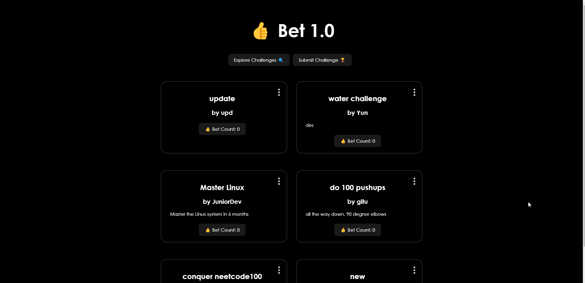

# Bet Web Application

## Overview
Bet is a platform where Gen Z users can post and accept challenges, fostering community engagement and adventure. Users can create, read, update, and delete challenges, with additional features like bet count tracking and user acceptance count.

## Features
- **Create, Read, Update, Delete (CRUD):** Users can manage challenges easily.
- **Bet Count Tracking:** Keeps track of challenge popularity.
- **User Acceptance Count:** Shows how many users have accepted a challenge.

## Achievements
- **Database Setup:** Utilized Supabase for efficient data management.
- **CRUD Operations:** Implemented seamless data handling.
- **User Interface Design:** Designed an intuitive interface.
- **Real-time Updates:** Enabled instant challenge updates with Supabase Realtime.

## Technologies
- **Frontend:** React.js
- **Backend:** Supabase
- **Styling:** CSS
- **Data Management:** Supabase JavaScript Library

## Showcase Screenshots
Include screenshots of homepage, challenge creation form, challenge details page, and any other relevant features.

## Showcase GIF

## Conclusion
Bet offers a dynamic platform for Gen Z users to connect and engage in exciting challenges. With its user-friendly interface and robust features, Bet provides an immersive experience for users seeking adventure and community interaction.
