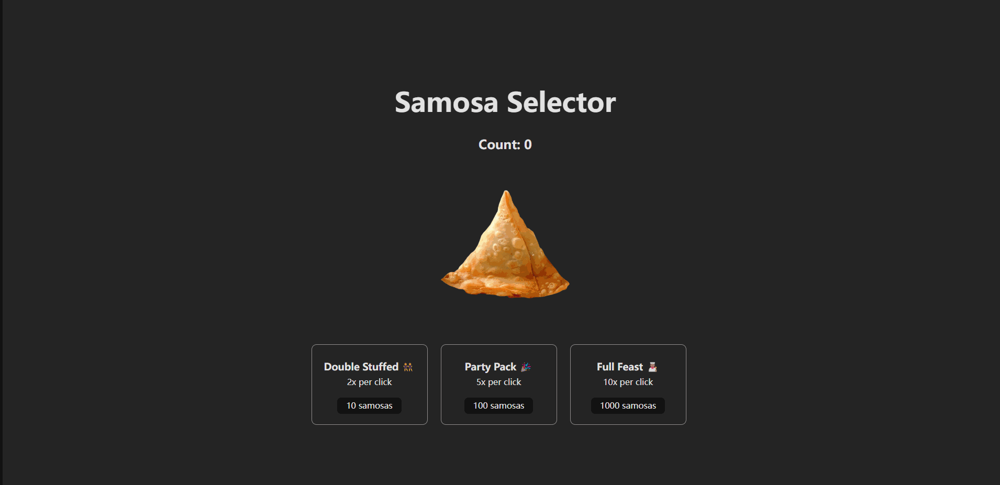

# Samosa Selector App

This is a simple React app called "Samosa Selector" where users can click on an image of a samosa to increase a count. Additionally, there are upgrade options available in the form of cards, which when clicked, increase the multiplier for the count increment.

## Features

- Click on the samosa image to increase the count.
- Upgrade options available through cards:
  - Double Stuffed 👯‍♀️: Increases count by 2x per click. Requires 10 samosas.
  - Party Pack 🎉: Increases count by 5x per click. Requires 100 samosas.
  - Full Feast 👩🏽‍🍳: Increases count by 10x per click. Requires 1000 samosas.

## Technologies Used

- React.js
- JavaScript
- HTML/CSS

## Installation

To run this app locally, follow these steps:

1. Clone this repository: `git clone https://github.com/your-username/samosa-selector.git`
2. Navigate to the project directory: `cd samosa-selector`
3. Install dependencies: `npm install`
4. Run the app: `npm start`

## Usage

- Click on the samosa image to increase the count.
- Click on the upgrade cards to increase the count multiplier.

## Screenshots

(Include screenshots of your app here, if applicable)

## Contributing

Contributions are welcome! If you find any bugs or have suggestions for improvements, please open an issue or create a pull request.

## License

This project is licensed under the [MIT License](LICENSE).

## Author

[Yun Gu](https://github.com/yungu23)
