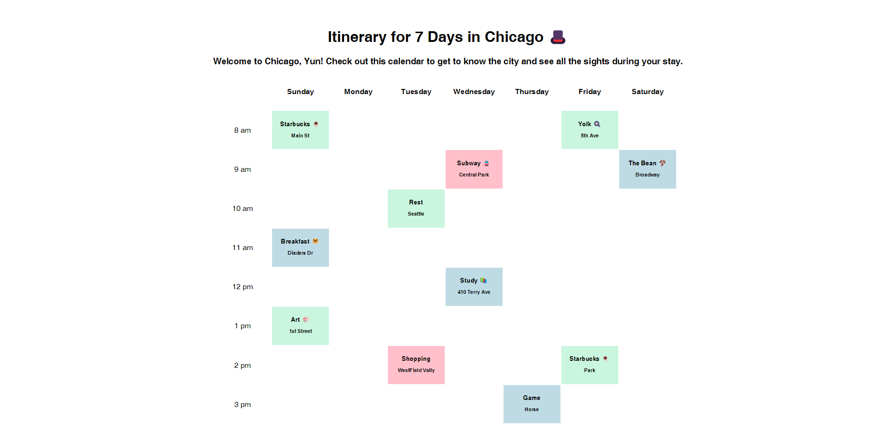

# Chicago Itinerary App

This is a simple React app that provides a weekly itinerary for exploring Chicago. The itinerary is displayed in a calendar format, with each day's events listed at various times.

## Features

- Displays a 7-day itinerary for exploring Chicago.
- Events are listed for each hour of the day, spanning from 8 am to 3 pm.
- Each event includes its name and location.
- Events are color-coded to differentiate between different types of activities.

## Technologies Used

- React.js
- JavaScript
- HTML/CSS

## Installation

To run this app locally, follow these steps:

1. Clone this repository: `git clone https://github.com/your-username/chicago-itinerary-app.git`
2. Navigate to the project directory: `cd chicago-itinerary-app`
3. Install dependencies: `npm install`
4. Start the development server: `npm start`

## Usage

- Upon launching the app, you will see a weekly itinerary for exploring Chicago.
- Each event is listed with its name and location.
- Events are color-coded to represent different types of activities.

## Screenshots

(Include screenshots of your app here, if applicable)

## Contributing

Contributions are welcome! If you find any bugs or have suggestions for improvements, please open an issue or create a pull request.

## License

This project is licensed under the [MIT License](LICENSE).

## Author

[Yun Gu](https://github.com/yungu23)
